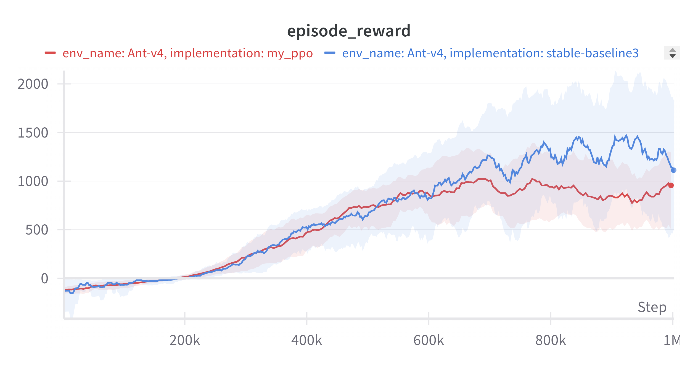
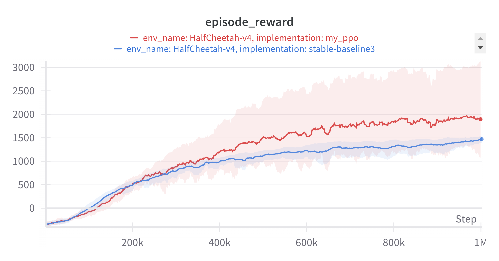
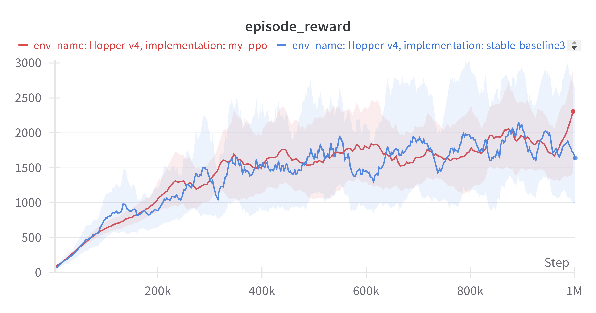
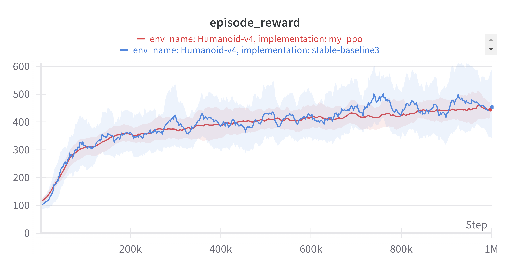
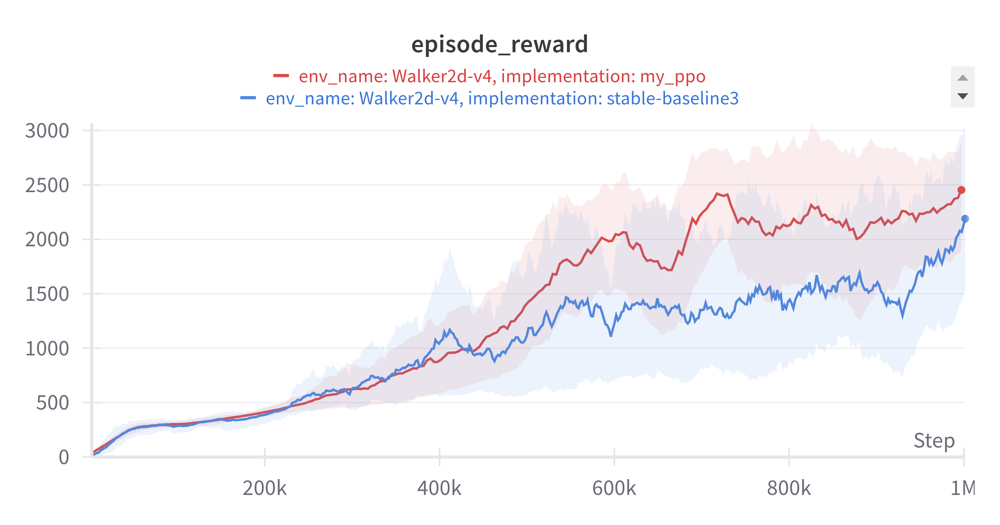

# PPO Single File Notebook Implementation
---
This implementation is a single file notebook PPO implementation. The implementation is based on the PPO implementation of [**OpenAI Spinning Up**](https://github.com/openai/spinningup/tree/master) and [**Stable-Baseline3**](https://github.com/DLR-RM/stable-baselines3). This implementation uses [*wandb*](https://wandb.ai/site) to log the performance. The performance is evaluated against **Stable-Baseline3** in Mujoco environments. The result can be view [here](https://api.wandb.ai/links/tcd-clearway/kh37ft8v).

## Install
---
The notebook has been tested with python 3.9 and 3.10.
Get dependencies:
> `conda create -n ppo python=3.10`

> `pip install -r requirements.txt`

The project is tested with Mujoco in gymnasium. Please have a look at [this](https://gymnasium.farama.org/environments/mujoco/) and follow the instructions on installing the Mujoco engine.

## Benchmarks
The performance of this project is evaluated against the PPO implementation of [**Stable-Baseline3**](https://github.com/DLR-RM/stable-baselines3) in Mujoco environments. The following shows the results in 5 environments: `Ant-v4`, `HalfCheetah-v4`, `Hopper-v4`, `Humanoid-v4`, `Walker2d-v4`
### Ant-v4

### HalfCheetah-v4

### Hopper-v4

### Humanoid-v4

### Walker2d-v4

